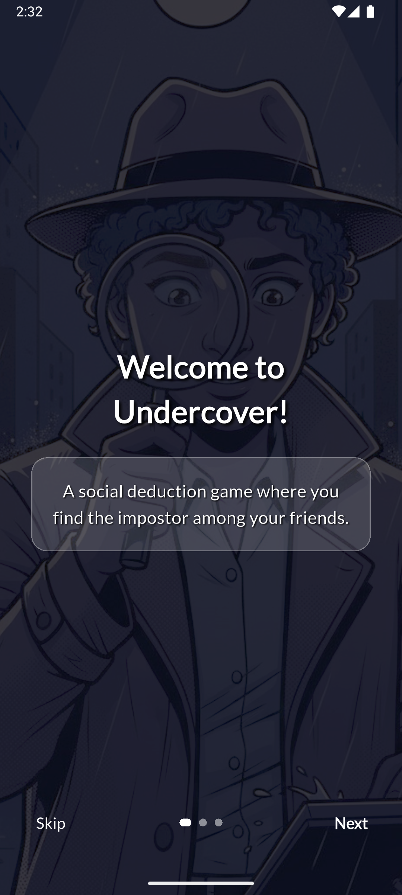
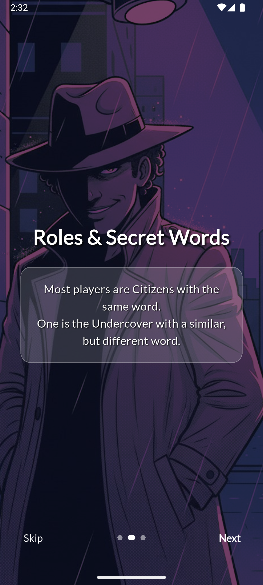
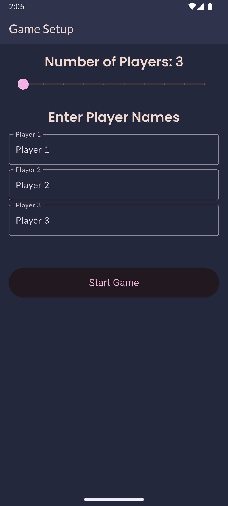
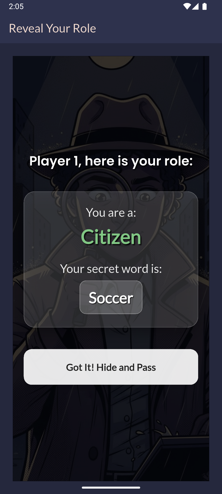
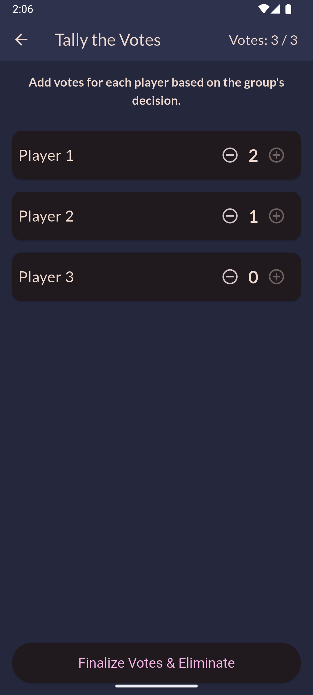
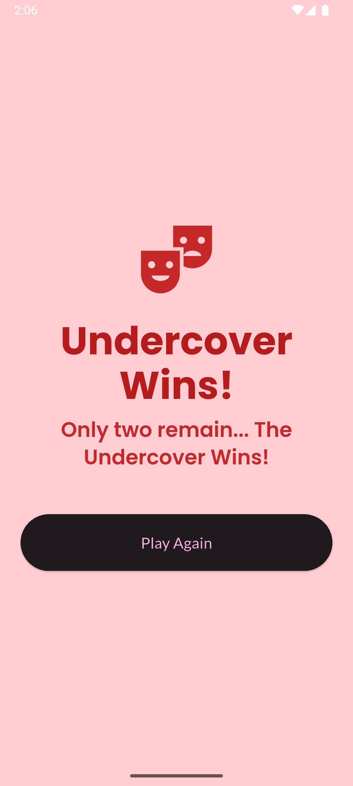

# Undercover - Flutter Tech Task

This is a Flutter-based mobile party game, created as a technical task. It's a social deduction game where players must uncover the 'Undercover' among them through word descriptions and voting.

The project not only fulfills all the core requirements but also includes a polished UI/UX with a custom theme, animations, an onboarding tutorial for new players, and custom-generated visuals.

## Screenshots

<div align="center">
  
  
  
</div>

<div align="center">
  
  
  
</div>

<div align= "center">
Tutorial Screen • Player Setup • Role Reveal • Voting • Game Over
</div>

## Features

- **Dynamic Player Setup**: Supports 3 to 12 players with custom names.

- **Private Role Distribution**: A "pass-the-phone" mechanic ensures each player's role and secret word remain private.

- **Custom Theming**: A unique, dark-themed UI with a custom color palette and typography (Poppins & Lato from Google Fonts).

- **Onboarding Tutorial**: A one-time tutorial for new users explaining the game rules, powered by shared_preferences.

- **Engaging Visuals**: Custom AI-generated images for 'Citizen' and 'Undercover' roles, enhancing the theme.

- **Robust Voting System**: A tally-based voting screen that correctly handles ties (no elimination) as per the rules.

- **Vote Limit**: The system prevents casting more votes than the number of active players, avoiding user error.

- **Polished Experience**: Custom animations, an adaptive app icon, and a clear game-over screen create a finished-product feel.

## How to Run the App

To run this project locally, follow these steps:

### Prerequisites:
- Ensure you have the Flutter SDK installed.
- An emulator or a physical device to run the app.

### Clone the Repository:
```bash
git clone https://github.com/ibrahimkahramann/undercover_game
```

### Navigate to the Project Directory:
```bash
cd your_project_folder
```

### Install Dependencies:
```bash
flutter pub get
```

### Run the App:
```bash
flutter run
```

## App Structure

The project follows a clean and scalable directory structure to separate concerns:

- **lib/main.dart**: The entry point of the application. It initializes the GameService provider and handles the one-time tutorial logic.

- **lib/models/**: Contains the core data models.
  - `player_model.dart`: Defines the Player object and PlayerRole enum.

- **lib/screens/**: Contains all major UI screens for the application (e.g., player_setup_screen, role_reveal_screen, voting_screen, etc.).

- **lib/services/**: Holds the core business logic and state management.
  - `game_service.dart`: The brain of the application. It's a ChangeNotifier that manages the entire game state, including player setup, role assignment, vote tallying, and win conditions.

- **assets/**: Contains all static assets like images and the app icon.